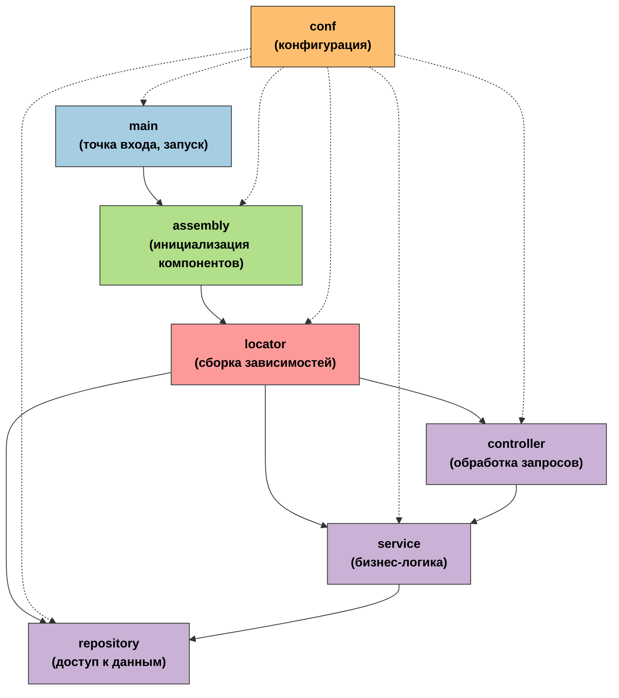

# isp-service-template

## О сервисе

`isp-service-template` — это шаблонный проект на Go, разработанный для ускорения создания микросервисов в рамках экосистемы `txix-open/isp`. Он предоставляет готовую архитектуру и инструменты, позволяющие разработчикам сосредоточиться на бизнес-логике, не тратя время на настройку инфраструктуры.
Сервис построен по принципам **Clean Architecture**, что обеспечивает чёткое разделение ответственности между слоями и упрощает сопровождение, тестирование и масштабирование кода. Каждый модуль в проекте выполняет строго определённую роль, что способствует читаемости и поддерживаемости приложения.

## Назначение и возможности

`isp-service-template` служит стартовой точкой для разработки микросервисов, обеспечивая:

- **Стандартизированную структуру проекта**: включает директории для конфигураций, контроллеров, доменных моделей, репозиториев, сервисов и тестов.
- **Интеграцию с `isp-kit`**: использует `bootstrap`-модуль для инициализации конфигураций, логирования, мониторинга и трассировки.

- **Поддержку REST и gRPC**: обеспечивает взаимодействие через HTTP и gRPC-интерфейсы.
- **Инструменты для тестирования**: содержит шаблоны и примеры интеграционных тестов, демонстрирующие взаимодействие между слоями и внешними системами.

## Архитектура и взаимодействие модулей

### Пояснения к схеме

- `main` — точка входа, инициализация приложения.
- `assembly` — связывает и инициализирует инфраструктуру.
- `locator` — собирает зависимости между слоями.
- `conf` — централизованная конфигурация, доступна всем слоям.
- `repository` — доступ к данным и внешним системам.
- `service` — бизнес-логика, использует репозитории.
- `controller` — обработка входящих запросов, вызывает сервисы.

## Описание модулей

### main

Точка входа в приложение.  
Инициализирует сервис через `bootstrap` из `isp-kit`, настраивает все зависимости и запускает сервер.

### assembly

Сборка компонентов приложения.  
Связывает конфигурацию, репозитории, сервисы и контроллеры между собой. Используется для внедрения зависимостей и инициализации инфраструктурных адаптеров.

Модуль содержит два файла:

- `assembly.go`
- `locator.go`

#### `assembly.go`

Файл `assembly.go` отвечает за инициализацию и сборку инфраструктурных компонентов приложения.  
Связывает между собой внешние клиенты, инфраструктуру, обработчики и настройки, обеспечивая целостную инициализацию приложения.

**Функции модуля**:

- Инициализация и конфигурация клиентов:
  - база данных (`dbrx`);
  - очередь сообщений (`grmqx`);
  - gRPC-сервер, HTTP-сервер, MDM-клиент и т.д.
- Регистрация зависимостей в `HealthcheckRegistry`.
- Создание _локатора зависимостей_ (`Locator`), через который инициализируются контроллеры и маршруты транспортов.
- hot reload удалённой конфигурации (`ReceiveConfig`).
- Передача собранных обработчиков в соответствующие инфраструктурные адаптеры (HTTP, gRPC, RMQ).
- Реализация интерфейсов `app.Runner` и `app.Closer` — управление жизненным циклом приложения (запуск и остановка).

#### `locator.go`

Файл `locator.go` реализует сборку зависимостей между слоями приложения, начиная с хранилищ (`repository`), через бизнес-логику (`service`), и заканчивая контроллерами и интерфейсными обработчиками (HTTP, gRPC, RMQ).

**Основные задачи:**

- **Построение зависимостей по слоям:**
  - Репозитории получают `db`-интерфейс.
  - Сервисы получают репозитории или менеджеры транзакций.
  - Контроллеры получают сервисы.
- **Сборка интерфейсных адаптеров:**
  - HTTP и gRPC-обработчики — через `routes`, с логированием (`httplog`, `grpclog`) и обёртками (`endpoint.DefaultWrapper`).
  - Обработчики сообщений (например, RMQ) — с передачей контроллеров и логированием.
- **Абстрагирование от инфраструктуры:**
  - Бизнес-логика и контроллеры не зависят от реализации инфраструктуры — сетей, БД, брокеров и т.д.
  - Тестирование и расширение упрощены: добавление новых транспортов (например, Kafka, WebSocket) не требует изменений в бизнес-логике.

### conf

Конфигурация приложения.

#### Удалённая конфигурация

В файле `remote.go` определяются структуры для настроек (например, параметры сервиса, БД, логирования, сетевых интерфейсов). Эти параметры подтягиваются из `isp-config-service`.
В файле `remote_test.go` находится проверка конфига в `default_remote_config.json`, конфигурация проверяется при помощи `txix-open/isp-kit/test/rct`.
В файле `default_remote_config.json` содержит дефолтный конфиг, который отправляется `isp-config-service` при подключении модуля.

#### Локальная конфигурация

Файл `config.yml` содержит локальную конфигурацию сервиса.
Файл `config_dev.yml` содержит локальную конфигурацию сервиса в режиме разработчика (используется если в переменной окружения `APP_MODE` указано `dev`)

Файл с конфигурацией включает настройки:

- IP и порт `isp-config-service` для подключения (`configServiceAddress`).
- Параметры логирования:
  - путь к файлу для сохранения логов (`logfile`);
  - семплирование (`logs.sampling`);
- IP и порта, на которых сервис принимает соединения (`grpcInnerAddress`).
- IP и порта, которые сервис передаёт передаёт `isp-config-service` (`grpcOuterAddress`) при запуске сервиса.
- Названия сервиса (`moduleName`).

### controller

Обработчики входящих сообщений.  
Содержит компоненты, принимающие данные извне — будь то HTTP/gRPC-запросы, сообщения из Kafka, задачи фоновых воркеров (bgjob) или другие источники.  
Отвечает за начальную обработку, валидацию и передачу данных в бизнес-логику (`service`).  
Контроллеры изолируют бизнес-логику от транспорта и форматов: HTTP, gRPC, RMQ, фоновые задачи.

### docs

Документация API.  
Содержит спецификации OpenAPI/Swagger или аналогичные описания интерфейсов сервиса.

### domain

Структуры запросов/ответов и ошибки.  
Содержит структуры данных (request, response), ошибки и коды ошибок, которые используются для обмена между слоями `controller` и `service`.
Этот модуль не содержит интерфейсов и бизнес-логики — только структуры запросов, ответов и общие ошибки, используемые между слоями `controller` и `service`.

### entity

Сущности предметной области.  
Содержит структуры, описывающие данные (например, модели БД или DTO), используемые в `repository` и `service`.

### migrations

Миграции базы данных с использованием [Goose](https://github.com/pressly/goose).  
Содержит SQL-скрипты для создания и изменения схемы БД.  
Для запуска миграций используется `migrationRunner`, который подключается при инициализации клиента (`dbx.WithMigrationRunner(...)`),  
но **сами миграции применяются явно** через вызов метода `Upgrade(...)` в коде, как правило при старте приложения или при обновлении конфигурации.

### repository

Слой доступа к внешним системам.
Содержит реализации интерфейсов, определённых в `service`, и инкапсулирует работу с внешними источниками данных — такими как базы данных, кеши, сторонние API и т. д.  
Этот модуль не содержит бизнес-логики, а лишь обеспечивает сохранение, извлечение и преобразование данных из внешних хранилищ.

### routes

Маршрутизация запросов.  
Настройка роутинга HTTP или gRPC: связывает URL/методы с контроллерами, может включать middleware.

### service

Бизнес-логика приложения.  
Реализация интерфейсов сервисов из `controller`. Содержит основную функциональность: обработку данных, валидацию, взаимодействие с репозиториями и другими сервисами.

### tests

Тесты.  
Содержит интеграционные тесты. Охватывает ключевые сценарии взаимодействия между модулями.

### transaction

Управление транзакциями.
В файле `manager.go` реализован пример менеджера транзакций (`Manager`), инкапсулирующего логику создания, выполнения и отката транзакций. Он используется для обёртывания бизнес-логики, использующей репозитории, в транзакции, обеспечивая атомарность и изоляцию операций с базой данных.
Основные задачи:

- Централизовать и упростить работу с транзакциями.
- Объединить связанные репозитории в рамках одной транзакции.
- Повысить читаемость и переиспользуемость бизнес-логики.
- Менеджер транзакций применяется в слое `service` при выполнении операций, требующих согласованности.

Менеджер транзакций используется в слое `service`.
